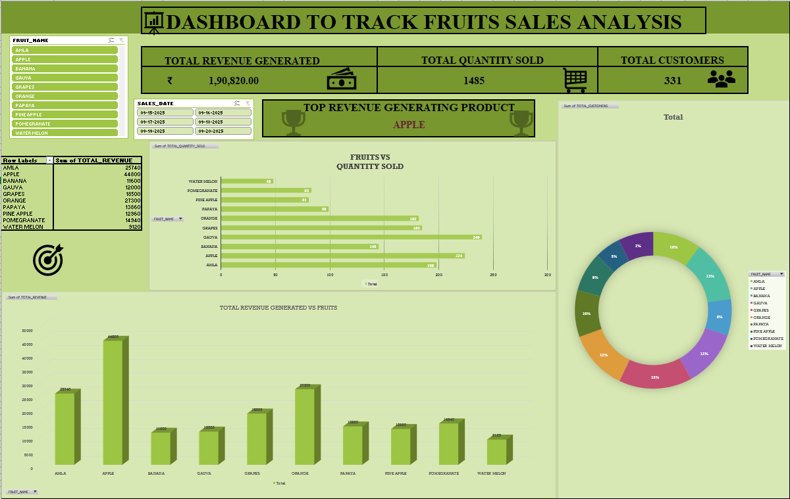

# Dashboard to track Fruits sales Analysis (Excel Project)

## Project Overview
This Excel project is a dashboard created to track and analyze fruits sales data.
It helps understand sales performance using visual charts and summaries.

---

## Tools Used
-> Microsoft Excel
-> Pivot Tables
-> Charts
-> Slicers

---

## Dashboard Features
-> Total sales overview
-> Fruit-wise sales analysis
-> Total customers visited
-> Interactive dashboard for easy analysis

---

## File Information
-> DashBoard to track fruits sales Analysis.xlsx – Main Excel dashboard file

---

## Purpose
This project is created for learning and showcasing Excel data analysis and dashboard skills.

---

## Dashboard Preview

